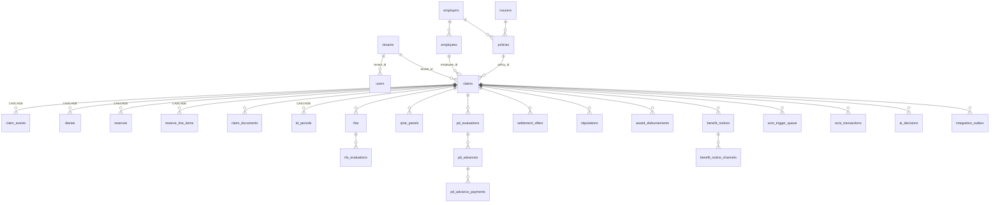
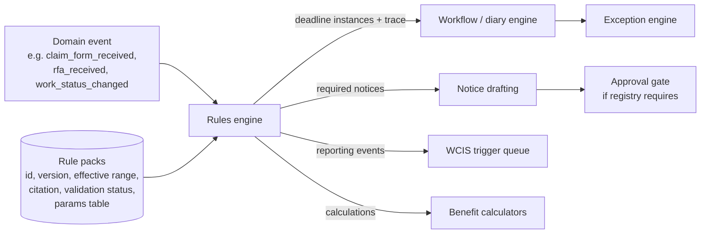
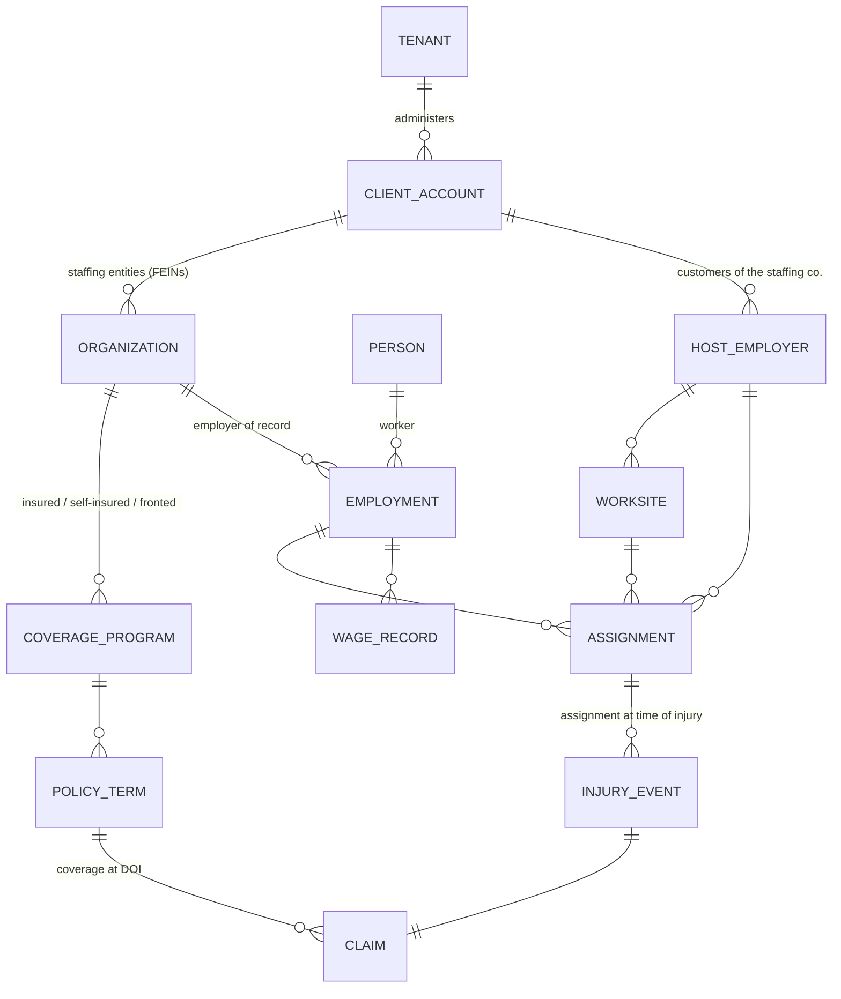
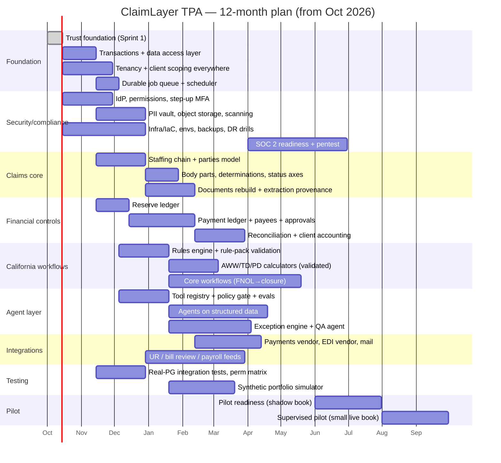

# ClaimLayer — California WC TPA Production Readiness Assessment

**Prepared:** 2026-10-01 · **Baseline commit:** `c3d27c6` (main) · **Scope:** the whole repository
(`backend/`, `frontend/`, `supabase/`, `docs/`, `.github/`, `scripts/`, `website/`)

**Target business:** a California-only workers' compensation third-party administrator serving
staffing / contingent-workforce companies, with experienced human adjusters making consequential
decisions and AI agents doing the administrative, analytical, drafting, monitoring, and QA work
around them.

**How this was assessed.** Every backend route, service, and migration was read. Claims about
behavior were checked against the code, and the most serious ones were verified by execution:

- All 30 migrations were applied in order to a real PostgreSQL 16 instance and the
  schema-contract script was run against it (`backend/scripts/migration-contract-test.js`: 33/33
  pass).
- The full backend suite was run: **81 suites, 1,278 tests, all passing**.
- Schema drift, RLS coverage, tenant columns, and cascade deletes were checked by querying that
  database's catalog, not by reading migrations alone.
- `npm audit --omit=dev` was run against the backend lockfile.

Where this document describes California legal rules, it does so only to name a workflow. It
does not assert statutory deadlines, rates, or procedures. Where the current code encodes such a
rule, the rule is described as "encoded, unverified" unless the repo commits a verified source
for it.

---

## A. Executive assessment

### What ClaimLayer is today

ClaimLayer is a **well-built reference implementation and demo** of an AI-assisted claims
workflow. It is not a claims system of record. Its own README says so: "a reference
implementation… not a live system processing real claims."

The repository is unusually disciplined for a demo. It has:

- deterministic guardrails enforced in service code rather than in prompts;
- a regulatory-source registry (`docs/regulatory/sources.json`) and explicit
  `REGULATORY-PENDING` markers where citations are not yet verified;
- idempotency keys, conditional-update claiming, and a transactional outbox in the newest code;
- a CI job that applies every migration to a real PostgreSQL.

It was designed as a **layer on top of a customer's retained system of record**. FileHandler is
named the authoritative financial ledger (`docs/data-model.md`: "FileHandler is authoritative").
That positioning is the single biggest architectural mismatch with the TPA goal. **A TPA is the
system of record.** It owns the claim file, the reserve and payment ledgers, the statutory
reporting, and the audit trail.

### How far it is from a production TPA platform

It is far, though the distance is in specific, nameable foundations rather than everywhere.

| Dimension | Distance | Why |
|---|---|---|
| Claims domain workflow knowledge | Short | Diaries, compensability decision model, TD periods, QME, PD, C&R, stips, WCIS FROI/SROI assembly all exist as working code |
| System of record (claims + money) | **Very far** | No payment ledger, no payee/bank model, reserves stored as snapshots, FileHandler (a mock) is "authoritative"; no staffing data model at all |
| Audit / traceability | Far | Four partial trails, none immutable; the AI audit table is broken on any database built from the committed migrations (verified) |
| Security / identity / tenancy | **Very far** | Self-assignable roles, no app-layer tenant scoping, 11 tables without RLS, one omnipotent role, MFA enforced on one route |
| Reliability | Far | No database transactions (supabase-js/PostgREST), 15 `setImmediate` fire-and-forget side effects, no job queue |
| Rules / deadlines | Far | Rules live as JS constants scattered across services, not versioned or effective-dated |
| Testing | Medium | Large suite, but 75 of 81 test files run against an in-memory Supabase mock that accepts any column. It cannot catch schema, constraint, RLS, or transaction defects, and it did not catch the `ai_decisions` drift |

A realistic estimate: **9–12 months** of focused work by a small senior team (3–5 engineers plus
a claims SME and a security lead) to reach a supervised pilot on a small live book. It will take
longer to reach the operational maturity of an established TPA platform. Section H has the plan.

### What can be retained

- **PostgreSQL** as the primary store, and the migration-first discipline with a real-Postgres
  contract test in CI.
- **The guardrail philosophy and its implementations:** controlled-vocabulary clamping,
  confidence-based triage, surgical-CPT routing to UR, the "no auto-deny" invariant, and
  deterministic MSA screening.
- **Document ingestion pipeline shape** (`documentIngestionService.js`): receipt-anchored clocks,
  triage queue, deterministic category→action rules, and compensation on partial failure.
- **Diary aftermath engine** (`diaryActionService.js`): claim-before-run, idempotency keys,
  dry-run preview, and outbox write-back. It is the best-engineered module in the repo.
- **WCIS EDI payload assembly** (`wcisPayloadService.js`, about 1,400 lines). It has extracted
  code lists, flat-file rendering, validation, and transmission batching. It is valuable, but it
  must be re-validated against the current DWC implementation guide before use.
- **Regulatory provenance practice:** `sources.json`, committed source documents, and pending
  markers.
- **Commutation / DEU table handling** (`commutationService.js`), which is verified against
  published worked examples.

### What should be redesigned

1. **Data access layer.** supabase-js over PostgREST gives no multi-statement transactions. That
   is why the codebase is full of hand-written compensating deletes. A system that moves money
   needs real transactions: a `pg` pool with a typed query layer, and the app connecting as a
   non-owner role.
2. **The canonical claim model.** Today it is one wide `claims` row with JSONB snapshots, a single
   `body_part` string, and a single `status` that conflates lifecycle, compensability, and
   litigation. It needs a normalized, temporally aware model with the staffing chain
   (staffing company → host employer → assignment → worker → injury → claim) as first-class
   entities.
3. **Financials.** Replace snapshot reserves and the external "authoritative" ledger with an
   append-only reserve ledger and payment ledger: integer cents, reversing entries, approval
   linkage, duplicate-payment controls, and bank/check reconciliation.
4. **Identity, authorization, and tenancy.** Make identity server-authoritative. Replace the
   single omnipotent `admin` role with permissions plus monetary authority. Scope every query by
   tenant and client, with RLS as defense in depth.
5. **Audit.** Build one immutable, hash-chained ledger of consequential actions, with domain
   events written in the same transaction as state changes.
6. **Rules.** Move to a versioned, effective-dated rules engine with provenance and a "validated"
   gate before any rule may drive automation.
7. **Async work.** Replace `setImmediate` with a durable Postgres-backed job queue and scheduler.
8. **Frontend.** The current SPA authenticates only through the dev auto-login endpoints and
   switches roles in client state. It needs real login, MFA, permission-aware UI, and a separate
   client (staffing company) portal.

### The biggest risks

1. **Privilege escalation to full admin is likely possible today.** Login reads `role` and
   `tenant_id` from Supabase `user_metadata`, which end users can write. Signups are enabled with
   no email confirmation in `supabase/config.toml`. See finding **S-1**.
2. **Cross-client data exposure.** The backend uses the service-role key, which bypasses RLS, and
   no query filters by tenant. Eleven tables, including `claim_documents` with medical text and
   original PDFs, have no RLS at all (S-2, S-3).
3. **An AI agent executes benefit authorizations.** An AI `auto_approve` on an RFA sets the
   decision to `auto_approved` by `ai_system` and issues the approval letter with no human (S-5).
   This contradicts the stated operating principle.
4. **The AI audit trail does not work on a database built from the migrations.** Every
   "required" audit insert fails, so compensability, RFA evaluation, and document classification
   would all throw in production (D-1, verified).
5. **No money controls exist** because no money ledger exists (Section C, Financial).
6. **Encoded statutory logic is unverified and partially wrong for staffing.** AWW assumes
   biweekly pay, which halves AWW for weekly-paid staffing workers. TD min/max are hardcoded to
   one year for every date of injury (D-3, D-4).

---

## Phase 1 — Current-system inventory

### 1. Current architecture

A single Node.js/Express process serves about 25 route groups. Routes call services, and services
call a Supabase client, external adapters, and the Anthropic API. The frontend is a React/Vite
SPA. A static demo build (`frontend/vite.demo.config.js`) replays captured API fixtures on GitHub
Pages.

```mermaid
flowchart LR
  SPA[React SPA<br/>role switcher in client state<br/>auth via /auth/dev-session] -->|cookie JWT| API[Express monolith<br/>backend/src/index.js]
  API --> SVC[~50 service modules]
  SVC -->|service-role key<br/>bypasses RLS| PG[(Supabase Postgres<br/>50 tables)]
  SVC -->|setImmediate x15| AI[Anthropic Claude]
  SVC --> OAI[OpenAI Whisper]
  SVC --> FH[FileHandler mock<br/>'authoritative ledger']
  SVC --> ADP[ADP mock]
  SVC --> STUBS[Lob / SendGrid / Twilio / WCIS<br/>stubs]
  CRON[3 workers: run() modules<br/>no scheduler in repo] --> SVC
```

There is no scheduler, queue, or worker process in the repo. Workers are `run()` functions
invoked by an external cron or by admin HTTP endpoints (`routes/admin.js`).

### 2. Major services and modules

| Area | Modules (backend/src/services) | Maturity |
|---|---|---|
| Claim core | `claimService` (921 lines), `claimLinkService`, `policyService` | Prototype: test store in production paths, no transactions |
| Intake | `routes/employer.js`, `voiceService`, `appointmentService`, `providerService` | Prototype (homecare-specific) |
| Documents | `documentIngestionService`, `pdfService`, `awardExtractionService` | Good pipeline shape; storage is not production-grade |
| AI | `aiService`, `aiDecisionsService`, `decisionBriefService`, prompts in `backend/prompts/` | Guardrails good; audit broken (D-1); no injection defenses |
| Diaries / actions | `diaryActionService`, `supervisorAlertService` | Best in repo |
| Medical | `rfaService`, `mmiService`, `qmeService`, `supplementalRequestService`, `enlyteService` (UR stub) | Workflow skeletons; AI auto-approval (S-5) |
| Benefits | `tdPeriodsService`, `pdService` (1,361 lines), `commutationService`, `adp.js` (AWW) | Mixed: DEU math verified; AWW/TD rates unverified (D-3/D-4) |
| Settlement | `pdPricingService`, `cnrService`, `msaScreeningService`, `settlementDocumentService`, `disbursementService` | Workflow exists; money handled as floats, no ledger |
| Notices | `noticeService` (1,187 lines), `noticeTemplateService`, `noticeDeliveryService`, `lobService` | Delivery truthfulness good; statutory text and timing unverified |
| State reporting | `wcisTriggerService`, `wcisPayloadService`, `wcisTransmissionService`, `wcis_adapters/*` | Substantial; adapters other than stub are empty |
| Integration | `outboxService`, `legacy/*`, `filehandler.js`, `adp.js` | Outbox good; legacy adapters are demo |
| Reporting | `reportingService` | Demo-level |

### 3. Database schema and relationships

There are 30 migrations and 50 public tables (verified). The core relationships are:



Structural problems, all verified against the applied schema:

- **`claims.employer_id` is `VARCHAR(100)` with no foreign key**, while `employers.id` is a UUID.
  Seed and test data use ids like `employer-brightcare-001`.
- **ID types are mixed** across tables: UUID, `VARCHAR(60)`, and `TEXT` with app-generated
  `claim_<ms>_<rand>`, `diy_*`, `evt_*`, and `doc_*` ids.
- **Duplicate concepts:** `documents` and `claim_documents`; `notices` and `benefit_notices`;
  `ai_decisions` defined twice with different column sets (D-1).
- **Only `users` and `claims` carry `tenant_id`** (2 of 50 tables).
- **`claim_events`, `reserves`, `diaries`, `td_periods`, and `reserve_line_items` are
  `ON DELETE CASCADE` from `claims`.** Deleting a claim silently destroys its "immutable" history
  and reserve history.
- **`docs/data-model.md` does not describe the actual schema.** For example, it documents
  `claim_events.event_type/triggered_by`, while the real columns are `type/timestamp/data`, with
  no actor column.

### 4. Authentication and authorization

- **Sessions.** Sessions are backend-minted HS256 JWTs (8h staff/employer, 24h employee) in a
  `token` cookie (`httpOnly`, `sameSite=lax`, **no `secure`**) or a Bearer header. One
  `JWT_SECRET` signs everything: magic links, employee sessions, and staff sessions. There is no
  revocation, logout, or session store.
- **Staff login.** `POST /auth/login` authenticates against Supabase Auth, then trusts
  `user_metadata.role` and `user_metadata.tenant_id` (`routes/auth.js:251–262`). Employer login
  trusts `user_metadata.employer_id` (`routes/auth.js:198–214`).
- **MFA.** MFA is enforced by `requireMFA`, which is applied to exactly one route
  (`POST /auth/magic-link/generate`). It is a no-op when `SUPABASE_URL` is unset.
- **Authorization.** Authorization is a role allow-list per route. About 120 route guards are
  `requireRole(['admin'])`. The `adjuster` role can log in but is accepted only by 3 RFA routes,
  so every real adjuster must be `admin`. There are no permissions, no authority limits, and no
  separation between system administration and claims authority.
- **Claim scoping.** `requireClaimScope` (`middleware/claimAccess.js`) does real IDOR protection
  for employee and employer callers, but it passes every admin and every supervisor GET.
- **Tenancy.** A `tenantId` is minted into tokens but **never read by any query** (verified by
  grep).
- **Frontend.** The frontend logs in only via `/auth/dev-session`, `/auth/dev-employer-session`,
  and `/auth/dev-supervisor-session` (`frontend/src/services/*.js`). No production login UI
  exists.

### 5. Current AI and agent architecture

There are six "agents." Five are single-shot Claude calls with authored prompts (`backend/prompts/*.txt`); one is
deterministic (MSA screening). There is no orchestration, tool use, memory, or multi-step
planning.

| Agent | Call site | Output use |
|---|---|---|
| Compensability analyst | `aiService.analyzeCompensability` via `setImmediate` on claim creation | Stored on `claims.ai_analysis`; sets `claims.priority`; emits `reserves_suggested` with **model-invented dollar figures** |
| RFA/MTUS evaluator | `aiService.evaluateRFA` | `auto_approve` → **RFA approved by `ai_system`** (S-5) |
| C&R pricing | `pdPricingService` | Range, hard-capped, human prices |
| Voice intake | `voiceService` (OpenAI Whisper → Claude) | Structured intake fields |
| Document classifier | `aiService.classifyDocument[FromPdf]` | Category, confidence, claim number → filing + diary |
| Award extraction | `awardExtractionService` (PDF document block) | Feeds disbursement proposals |

Things that work well:

- output-enum clamping (`_applyClassificationGuardrails`);
- the forced `physician_review` fallback;
- surgical-CPT override;
- `SIGNAL_OVERRIDES.applies_to` (a real fix for model over-signaling);
- a `required: true` audit contract.

Things that are missing:

- schema validation of model output beyond field presence (types, ranges, enums for `priority`
  and the reserve figures);
- an untrusted-content boundary for document text;
- per-tenant data isolation in prompts;
- model/prompt version pinning in the audit row (only a model string is stored, with no prompt
  hash in the code path);
- an evaluation harness beyond 13 golden PDFs;
- degradation policy (the compensability analysis simply never appears when the API is down).

The compensability prompt is **home-health-specific**. It says "Home health aides and home care
workers have broad AOE/COE coverage… presumptively compensable." It embeds legal assertions and
reserve dollar norms inside the prompt. That is the opposite of "legal rules separable from model
reasoning."

### 6. Claims workflow currently implemented

1. Employer FROI (`/employer/froi`) creates a claim. ADP is pulled, and AWW/TD rates are
   computed (D-3/D-4).
2. Five initial diaries are seeded, all assigned to `config.adjuster.email` — a single adjuster
   from an env var.
3. Fire-and-forget steps follow: AI analysis, DWC-7 notice, and WCIS FROI enqueue.
4. Compensability is decided through the diary aftermath (accept / deny / delay).
5. TD periods, RFA/UR routing, MMI/PR-4 solicitation, QME panels, PD rating and advances,
   stipulations, C&R with MSA gate, award disbursement proposals, and closure/reopen follow.

The status machine (`claimService.VALID_TRANSITIONS`) is linear. A `denied` claim is terminal:
it cannot become litigated, be accepted later, or be partially accepted. There is no per-body-part
compensability. "Delayed" is not a status.

### 7. Document ingestion and extraction pipeline

1. PDF or text arrives (upload, or the email webhook).
2. `pdfjs-dist` extracts the text layer. If fewer than 120 characters come back, the PDF is sent
   to Claude as a document block instead.
3. The classifier returns a category, a confidence score, a verbatim claim number, a summary, and
   key fields.
4. The document is routed to triage when confidence is under 70, when no claim matches, or when
   the category was forced by a guardrail.
5. A deterministic `DOC_ACTION_RULES` table creates a diary.

Storage is a base64 TEXT column (`claim_documents.pdf_buffer_b64`). There is no object storage,
no malware scanning, no content disarm, no hash for integrity, and no OCR beyond the model. Field
extractions keep no provenance (page or span), and a document has no versioning beyond a
`version` integer.

### 8. External integrations

| Integration | State |
|---|---|
| Anthropic | Live with key; SDK retries; 45–60s timeouts |
| OpenAI Whisper | Live with key; voice transcripts (PHI) |
| FileHandler (JW Software) | Python mock; "authoritative ledger" |
| ADP | Python mock; AWW source |
| Lob, SendGrid, Twilio | Stubs, plus signature-verified Lob webhook |
| WCIS EDI | Stub adapter; `sftpAdapter` and `vendorAdapter` are 33-line placeholders |
| Enlyte UR, DxF, Health Gorilla | Stubs / TODO webhooks |
| Legacy SoR | `MockLegacyAdapter` over `legacy_*` tables |

### 9. Audit logging

There are four partial trails, and none is immutable or complete:

- `claim_events` has no actor column, cascades on claim delete, and is deleted by compensation
  code (`documentIngestionService.js:518`, `diaryActionService`).
- `audit_log` has an optional actor. Its RLS policy is `FOR ALL` for admin, so UPDATE and DELETE
  are allowed via PostgREST.
- `ai_decisions` is broken on a fresh schema (D-1). It is also mutated in place by
  `linkHumanDecision`, which links the *most recent* row for a claim and type within 7 days
  rather than the specific recommendation shown, and writes `human_reviewer_id: null` from
  `claimService.updateStatus`.
- Winston request logs (`middleware/audit.js`) go to stdout only.

### 10. Testing coverage

There are 1,278 backend tests in 81 suites and 84 frontend tests, plus a real-Postgres
migration/contract script (33 assertions) and a live-model ingestion eval (13 PDFs).

- **75 of 81 backend test files use the in-memory Supabase mock**, which accepts any column and
  enforces no constraints, RLS, or transactions. No Jest test touches real Postgres.
- Production code contains test hooks: the `claimService._testStore` override map is checked
  first by `getClaim`.
- There are no permission-matrix tests, no property-based financial tests, no load tests, and no
  synthetic-portfolio simulation.

### 11. Deployment and infrastructure

- There is **no deployable backend configuration** in the repo: no Dockerfile, IaC, process
  manager, or scheduler.
- CI runs the tests and deploys only the static marketing site and demo (`pages.yml`).
- Migrations are applied manually.
- No environments are defined (dev / staging / prod).
- The root `package.json` scripts force `NODE_ENV=development`, which enables the dev
  auto-login endpoints.

### 12. Security controls present

- `helmet`;
- `express-rate-limit` (in-memory, per process);
- `express-validator` on most inputs;
- HMAC webhook verification with timing-safe compare, and Lob timestamp tolerance;
- webhook dedupe (`webhook_events`);
- atomic single-use magic links;
- employee/employer IDOR middleware;
- `.gitignore` for secrets;
- `pdfjs` `isEvalSupported:false`.

### 13. Prototype and demo code

- `claimService._testStore` in production read paths.
- Hardcoded `EMPLOYER_SEED` in `db.js` (fallback employers with non-UUID ids) and
  `PROVIDERS_SEED` / `ZIP_COORDS` (12 zip codes).
- `routes/claims.js:465–527`: DWC-1 signature request and intake-progress endpoints mutate an
  in-memory object and **persist nothing**, while telling the worker "Your adjuster will contact
  you."
- `routes/employer.js`: the token-registration call is not awaited, and the `magic_link_sent`
  event is pushed to an in-memory array (not persisted).
- `frontend/src/mockData.js` is imported by five production components.
- The frontend role switcher lives in `App.jsx` state.
- There are 65 "HomeCare TPA" / `HHW-` references; the claim number format is `HHW-YYYY-NNN`.
- Duplicate router mount: `employerRouter` is mounted twice in `index.js`.
- `deferred_penalty_flags` is labelled TEMPORARY. `pdrs_lookup` holds five seeded rows and says
  "must be seeded from official DWC 2005 PDRS schedule before… live claims."

### 14. Reasonably production-ready areas

These are production-ready *as patterns*; each still needs to be moved onto transactions and
tenancy.

- the `diaryActionService` aftermath engine (claim, idempotency, dry-run, outbox);
- `outboxService` and `noticeDeliveryService` (truthful delivery states, per-channel tracking,
  webhook dedupe);
- WCIS payload assembly and code lists (to be re-validated);
- `commutationService` (DEU tables verified against published examples);
- webhook signature verification;
- the migration CI job;
- ingestion triage routing and receipt-anchored deadlines.

---

## B. Proposed production architecture

The target is a **modular monolith** on PostgreSQL with strict internal module boundaries. It
does not need microservices. Domain modules own their tables and expose services, and
cross-module effects go through domain events and an outbox. Every consequential state change
writes, **in one database transaction**:

- the state change itself;
- a domain event;
- an immutable audit-ledger entry.

```mermaid
flowchart TB
  subgraph Clients
    ADJ[Adjuster / Supervisor workspace]
    CP[Client portal<br/>staffing companies]
    WP[Worker portal / IVR / SMS]
    OPS[Internal ops & admin console]
  end

  subgraph Edge
    IDP[Identity provider<br/>OIDC/SAML SSO + MFA/WebAuthn]
    GW[API gateway / WAF<br/>rate limits, mTLS to vendors]
  end

  subgraph App["ClaimLayer modular monolith (Node/TypeScript)"]
    AUTHZ[AuthZ: permissions + authority limits<br/>tenant/client scoping]
    CLAIMS[Claims core<br/>parties, staffing chain, claim, body parts]
    MED[Medical mgmt<br/>RFA/UR, work status, MPN]
    BEN[Benefits<br/>AWW, TD/TPD, PD, death]
    FIN[Financial ledger<br/>reserves, payments, recoveries]
    LIT[Litigation & med-legal<br/>WCAB, QME/AME, liens, settlement]
    DOCS[Documents<br/>object store, extraction, provenance]
    COMMS[Correspondence & notices]
    WF[Workflow & diary engine<br/>tasks, deadlines, SLAs]
    RULES[Rules engine<br/>versioned, effective-dated, provenance]
    EXC[Exception engine<br/>continuous file audit]
    APPR[Action requests & approvals]
    AGENTS[Agent orchestration<br/>tool registry, policy gate, evals]
    RPT[Reporting & analytics]
  end

  subgraph Data
    PG[(PostgreSQL<br/>OLTP + RLS by tenant/client)]
    LEDGER[(Audit ledger<br/>append-only, hash-chained)]
    OBJ[(Object storage<br/>encrypted, versioned, WORM option)]
    VAULT[(PII vault / tokenization<br/>SSN, bank accounts)]
    WH[(Warehouse<br/>read replicas / CDC)]
  end

  subgraph Async
    Q[Durable job queue + scheduler<br/>Postgres-backed]
    OUTBOX[Transactional outbox]
  end

  subgraph Integrations
    PAY[Payment rails / check vendor / bank]
    EDI[WCIS EDI vendor]
    UR[UR / IMR vendors]
    BR[Bill review / PBM / MPN]
    MAIL[Print-mail / e-delivery]
    PAYROLL[Client payroll / staffing ATS]
    LLM[LLM providers<br/>via model gateway]
  end

  OBS[Observability: logs (redacted), metrics, traces, alerts, SIEM]

  ADJ & CP & WP & OPS --> GW --> App
  IDP -.tokens.-> GW
  App --> PG
  App --> LEDGER
  DOCS --> OBJ
  CLAIMS --> VAULT
  App --> OUTBOX --> Q
  Q --> Integrations
  AGENTS -->|redacted, tenant-scoped context| LLM
  AGENTS -->|proposals only| APPR
  APPR -->|approved| FIN & CLAIMS & COMMS & MED
  RULES --> WF & EXC & BEN & COMMS
  PG --> WH --> RPT
  App -.-> OBS
```

### Component responsibilities

| Component | Responsibility | Key decisions |
|---|---|---|
| **Frontend** | Adjuster workspace, supervisor/exception console, client portal, worker portal | Separate client-portal app (different threat model). No client-side role switching. Permission-aware UI driven by the server's permission set |
| **API / backend** | Modular monolith, TypeScript (incremental: `checkJs` first, then TS for new modules) | `pg` pool with transactions. Connect as a non-owner role. `SET LOCAL app.tenant_id` per request so RLS is real defense in depth |
| **Database** | PostgreSQL 16+, managed (Supabase, RDS, or Cloud SQL) | Every business row carries `tenant_id` + `client_id`. Integer cents. Effective-dated facts. No cascade deletes on regulated data |
| **Document storage** | Encrypted object storage, versioned, optional object lock | Content hash on ingest. AV scan plus PDF sanitization before any parser or model sees it. Short-lived signed URLs per request |
| **Agent orchestration** | Tool registry, policy gate, context builder, model gateway, eval harness | Agents read structured claim data via tools. Writes only through autonomous-tier tools or action requests (Section E) |
| **Event/audit system** | Domain events (outbox) + immutable hash-chained audit ledger | Ledger rows written in the same transaction as the state change. Periodic chain-head anchoring to WORM storage |
| **Rules engine** | Rule packs: versioned, effective-dated, with citations and validation status | Only `validated` rules may drive automation. `unverified` rules produce advisory tasks only. Every computed value stores `rule_id@version` + inputs (trace) |
| **Task/workflow engine** | Diaries/tasks with assignment, SLA, escalation; deadline instances computed by rules | Durable Postgres-backed queue (e.g., pg-boss or graphile-worker) + scheduler. Long-running state lives in tables, not timers |
| **Integration layer** | Adapters behind interfaces, outbox delivery, inbound webhooks with dedupe | Idempotency keys end to end. Reconciliation jobs for every external system that holds money or regulatory state |
| **Authentication** | External IdP (OIDC/SAML for client SSO; WebAuthn/TOTP MFA) | Identity → `users` row (server-controlled) → roles, permissions, authority grants. Step-up MFA for financial and legal actions |
| **Reporting** | Client loss runs, open/closed reports, reserve and payment registers, regulatory audit reports | Read replica or warehouse via CDC. Client reports are always client-scoped by construction |
| **Observability** | Structured logs with PHI redaction, metrics, traces, SLO alerts, security events to SIEM | Correlation id from request → job → agent run → ledger entry |

### Event and audit architecture (recommendation)

**Full event sourcing is not recommended** for the whole system. It complicates corrections,
reporting, and onboarding without proportional benefit. Recommended instead is a **hybrid**:

1. **Current-state tables** remain the operational source for reads.
2. **An append-only domain event** is written in the same transaction as each state change, so
   history is reconstructable.
3. **An immutable audit ledger** covers consequential actions. It is hash-chained per tenant,
   UPDATE/DELETE/TRUNCATE are blocked by triggers and privileges, and chain heads are anchored
   externally.
4. **Bitemporal / effective-dated records** hold facts that are corrected over time: body-part
   status, wages, work status, representation. Corrections add rows; they never overwrite.
5. **Financial ledgers are double-entry style.** Entries are never updated; corrections are
   reversing entries.

Each consequential ledger entry answers the reconstruction questions directly:

| Question | Ledger field(s) |
|---|---|
| What happened / when | `action`, `occurred_at`, `recorded_at`, `seq` |
| Who or what initiated it | `actor_type` (human/agent/system/integration), `actor_id`, `actor_role` |
| What data was available | `payload.snapshot` or `payload.snapshot_ref` (hash of the claim projection at decision time) |
| What the agent recommended | linked `ai_decision_id` + `action.proposed` entry |
| What evidence it relied on | `evidence[]` (document ids, page/span refs, rule ids@version) |
| Human approve / modify / reject / override | `action.approved` / `action.modified` / `action.rejected` with rationale + diff |
| What was executed | `action.executed` with the execution result |
| Notice / document / payment produced | `entity_type` / `entity_id` of the produced artifact |
| External success or failure | `integration.delivered` / `integration.failed` (outbox outcome) |

**Sprint 1 implements the ledger and the action-request lifecycle** (Section I). Sprint 2 makes
ledger writes transactional.

### California workflow engine (architecture, not rules)



Rule pack properties:

- **Identity:** `rule_id`, `version`, `jurisdiction`, `effective_from/to` (selected by the legally
  relevant date: DOI, receipt date, service date, etc. — which date applies is itself part of the
  validated rule).
- **Provenance:** `citation`, `source_document` (a committed file under `docs/regulatory/`),
  `verified_by`, `verified_at`, `status ∈ {draft, unverified, validated, retired}`.
- **Logic:** deterministic code functions registered by rule id. Numeric parameters (rates,
  day counts) live in data tables so annual updates are data changes with review, not code
  changes.
- **Testing:** each rule version ships golden test vectors. CI fails if a validated rule's
  vectors change without a version bump.
- **Model isolation:** models never compute rule outputs. They may extract the inputs (dates from
  documents), which humans confirm when the input drives a deadline.

Workflows to model as rule-driven state machines, with all specific timings to be supplied from
validated sources:

- FNOL;
- initial three-point contact;
- compensability investigation → accept / delay / deny (per claim **and per body part**);
- benefit notices; wage/AWW; TD/TPD; PD (rating, advances); medical treatment and RFA → UR →
  IMR;
- QME/AME (panel, strikes, scheduling, reports, supplementals); representation changes;
  litigation (DOR, hearings, MSC/trial);
- body-part amendments; reserve reviews; settlement (Stip, C&R, MSA); liens;
- MMI/P&S; vocational / SJDB where applicable; death claims;
- closure; reopening (with the statute-of-limitations rule as a validated rule);
- diary/deadline management; WCIS reporting events.

The repo already encodes several of these (for example `COMPENSABILITY_NOTICE_DUE` in
`diaryActionService.js`), with honest `REGULATORY-PENDING` notes. Migration means lifting those
constants into rule packs with status `unverified` until a licensed reviewer signs them off.

---

## C. Gap inventory

Severity: **P0** = launch blocker · **P1** = required before the first meaningful production book
· **P2** = important shortly after launch · **P3** = future enhancement.

### Claims system of record

| Gap | Sev | Existing state | Required state | Recommended solution | Dependencies |
|---|---|---|---|---|---|
| ClaimLayer is not the system of record | P0 | FileHandler (mock) "authoritative" for financials and diaries | ClaimLayer owns claim, financial, diary, and document records | ADR: ClaimLayer is SoR; legacy adapters become import/migration tools | Financial ledger, transactions |
| No staffing data model | P0 | `employers` → `employees` → `claims`; zero staffing concepts | staffing company → host employer → worksite → assignment → worker → injury → claim | New party/employment/assignment model (Section D) | Tenancy/client model |
| Single-body-part, single-status claim | P0 | `claims.body_part` string; one `status` | Claimed body parts with per-part status (claimed/accepted/denied/delayed/disputed), effective-dated; multi-axis status | `claim_body_parts` + `body_part_determinations`; status axes: lifecycle, compensability, litigation, benefit | Rules engine |
| Denied is terminal; no "delayed" | P0 | `VALID_TRANSITIONS.denied = []` | Reversible determinations, litigation from denial, partial acceptance | State machines per axis; determinations as events | Approval framework |
| Wage/AWW not modeled | P0 | `claims.aww` / `td_rate` snapshot from ADP; biweekly assumption (D-3) | Wage statements by source/period, multiple employment, pay frequency, versioned AWW calc with adjuster approval | `wage_records`, `aww_calculations` (rule-versioned) | Rules engine, staffing model |
| No contact/party model | P1 | Attorney fields on `claims`; physician strings | Parties with roles (worker, attorney, PTP, QME, defense counsel, lien claimant, vendor) and contact points | `parties`, `party_roles`, `claim_participants` | — |
| No notes model | P1 | `decision_note` on diaries; FileHandler notes | First-class notes with author, type, privilege flag, immutability (edits versioned) | `claim_notes` (append-only versions) | Ledger |
| Litigation / liens / WCAB | P1 | Representation fields only | Litigation matter, ADJ case numbers, hearings, issues, defense counsel, liens | `litigation_matters`, `hearings`, `liens` | Party model |
| Tasks: single adjuster | P1 | All diaries assigned to `config.adjuster.email` | Assignment rules, queues, workload balancing, reassignment audit | `assignments`, `work_queues` | AuthZ |
| Claim numbers | P2 | `HHW-YYYY-NNN`, sequential, guessable | Tenant/client-prefixed, non-enumerable external ids | Number allocator per client | Tenancy |

### Event and audit architecture

| Gap | Sev | Existing state | Required state | Recommended solution | Dependencies |
|---|---|---|---|---|---|
| No immutable audit ledger | P0 | Four partial, mutable trails | One append-only, hash-chained ledger for consequential actions | `audit_ledger` with triggers + privileges + verify fn (**Sprint 1**) | — |
| History deletable | P0 | `claim_events` CASCADE; compensation code deletes events | No deletes of history; corrections are new events | **CASCADE removed from every FK into `claims` (Sprint 2).** Compensating deletes remain in `diaryActionService` / `documentIngestionService` until they become transactions (increment 2) | Transactions |
| AI decision trail broken (D-1) | P0 | Insert fails on migrated schema | Working, contract-tested | Reconciling migration (**Sprint 1**) | — |
| Recommendation ↔ decision linkage | P0 | "Most recent row within 7 days", mutated in place | Explicit ids: decision references the exact recommendation shown | `action_requests.ai_decision_id` (**Sprint 1**) | Approval framework |
| No actor on events | P1 | `claim_events` has no actor | Actor type/id/role on every event | Ledger columns; event writer requires actor | AuthZ |
| No snapshot of "what was known" | P1 | Partial `input_snapshot` on AI calls | Hash/ref of claim projection at decision time | Snapshot refs in ledger payload | Claims core |

### Financial controls

| Gap | Sev | Existing state | Required state | Recommended solution | Dependencies |
|---|---|---|---|---|---|
| No payment ledger | P0 | No `payments` table; TD periods have no payments; FileHandler mock | Append-only payment ledger: request → approval → issuance → clearance / void / stop / reissue / return | `payment_requests`, `payments`, `payment_events`, allocations | Approval framework, payee model |
| Reserves are snapshots | P0 | `reserves` rows with totals; `claims.reserve_*` never written | Reserve transactions (delta + resulting balance by bucket) with approval link; current reserve derived | `reserve_transactions` ledger; incurred = paid + outstanding | Ledger, approvals |
| Floating-point money | P0 | JS floats + `Math.round` (`adp.js`, `pdService`, `disbursementService`) | Integer cents or a decimal library; rounding rules defined per calculation | `money.js` helpers; DB `bigint` cents | — |
| No authority limits | P0 | Any `admin` can set any reserve or record any payment | Per-user monetary authority by action and bucket; escalation by claim flags; client overrides | Authority policy (**Sprint 1**) + `authority_grants` (Sprint 3) | AuthZ |
| No duplicate-payment prevention | P0 | None | Idempotency keys; duplicate detection (payee, amount, period, invoice); overlapping benefit-period checks | Unique constraints + pre-issue checks | Payment ledger |
| No payee / bank / tax model | P0 | Payee is a string to FileHandler | Payees with verified TIN/W-9, bank accounts in a vault, positive pay | `payees`, vault tokens, 1099 reporting | PII vault |
| Benefit periods disconnected from payments | P1 | `td_periods` has rate and dates only | Payments allocated to benefit periods; overpayment/underpayment computed | Allocation table + calculators | Rules engine |
| Voids / reissue / recoupment / overpayment | P1 | `pd_advance_payments.voided` only | Full lifecycle with reversing entries and recovery tracking | Payment state machine | Payment ledger |
| Reconciliation | P1 | None | Daily bank / check-register / trust-account reconciliation; client funding reconciliation | Recon jobs + exception queue | Payment rails |
| Client-level accounting | P1 | None | Per-client loss funds, deposits, invoices for fees | Client ledger | Client model |
| Recoveries / subrogation / liens | P2 | `subrogation_status` enum | Recovery ledger, lien resolution | — | Litigation model |

### Human approval architecture

| Gap | Sev | Existing state | Required state | Recommended solution | Dependencies |
|---|---|---|---|---|---|
| No approval framework | P0 | Route role checks; approvals implicit | AI/human proposes → authorized human approves/modifies/rejects with rationale → system executes → ledger | Action registry + `action_requests` (**Sprint 1**) | Ledger |
| No autonomy tiers | P0 | Implicit per service | Explicit registry: autonomous / prepare-for-approval / analyze-only per action | `policy/actionRegistry.js` (**Sprint 1**) | — |
| AI executes RFA approvals (S-5) | P0 | `_autoApproveRFA` by `ai_system` | Treatment authorization requires a human approval (or a validated, client-approved rule-based auto-authorization with no model in the decision) | Route AI `auto_approve` to the approval queue | Approval framework |
| Self-approval / SoD | P1 | Not modeled | Proposer ≠ approver; admin ≠ claims authority | Enforced in `approvalService` (**Sprint 1**) | AuthZ |
| Configurable thresholds by client / claim flags | P1 | None | Thresholds by action, amount, client, litigation, representation, risk flags | Authority policy with client overrides (**Sprint 1** code defaults; DB-backed in Sprint 3) | Client model |

### California workflow engine

| Gap | Sev | Existing state | Required state | Recommended solution | Dependencies |
|---|---|---|---|---|---|
| Rules scattered as JS constants | P0 | `DOC_ACTION_RULES`, `AFTERMATH_RULES`, `DISBURSEMENT_POLICY`, `PD_RATES_2026`, TD min/max, initial diaries | Versioned, effective-dated rule packs with provenance and validation status | Rules engine (ADR-0005, Sprint 3) | Licensed reviewer |
| Unverified rules drive automation | P0 | Notices and deadlines fire on unverified rules | Only validated rules automate; unverified → advisory | Validation gate in rules engine | Rules engine |
| TD/AWW calculators incorrect for staffing | P0 | Biweekly assumption; one year's min/max (D-3/D-4) | Rule-versioned calculators selected by applicable date; pay-frequency aware; adjuster-approved inputs | Benefit calculator module | Wage model, rules |
| Determination-dependent notices issued early | P1 | **Fixed in #87:** referral no longer sends them. A determination return path does not exist yet | Notices generated only from the determination event they describe | Event-driven notice rules, plus the UR determination return path | Rules engine |
| QME/AME, litigation, liens, death, vocational | P1–P2 | QME skeleton; others absent | Full workflows | Per-workflow state machines | Claims core |
| Diary/deadline engine | P1 | Diaries with no-snooze flag; due dates as strings | Deadline instances with rule trace, business calendar (holiday table), escalation SLAs | Workflow engine | Rules engine |
| WCIS production readiness | P1 | Stub adapter; guide v3.1 (2018) | Current guide verified; vendor adapter; ack reconciliation; test-then-production certification | EDI vendor (outsourced transport) | Trading partner setup |

### Agent architecture

| Gap | Sev | Existing state | Required state | Recommended solution | Dependencies |
|---|---|---|---|---|---|
| Agents can write directly | P0 | Services write model output to claims (`priority`, `ai_analysis`), auto-approve RFAs | Agents write only through registry-gated tools or action requests | Tool registry + policy gate | Approval framework |
| No output schema validation | P1 | Field-presence checks only | JSON-schema validation (types, ranges, enums) + clamping + reject-to-human | Schema per prompt | — |
| Legal assertions in prompts | P1 | Compensability prompt asserts presumptions and reserve norms | Prompts consume rule outputs as inputs; no embedded law or numbers | Prompt rewrite with rule-context injection | Rules engine |
| No provenance for conclusions | P1 | Summaries without citations | Every conclusion cites document id + page/span or structured field id; uncited claims rejected | Citation-required output schema | Document extraction |
| No eval harness | P1 | 13 golden PDFs | Labeled datasets per agent; regression thresholds in CI per prompt/model version | Eval service + datasets | Synthetic portfolio |
| No degradation policy | P1 | Missing analysis is silent | Each agent declares fallback (manual task); SLO alerts on agent backlog | Agent runner with fallbacks | Job queue |

### Supervisor / exception management

| Gap | Sev | Existing state | Required state | Recommended solution | Dependencies |
|---|---|---|---|---|---|
| Exception engine | P1 | Daily digest of due/overdue diaries (`supervisorAlertService`) | Continuous detectors: overdue contacts, approaching deadlines, missing notices, reserve inconsistency, unexplained reserve change, payment irregularities, untreated recommendations, stale litigation, new body parts, restrictions vs benefits, actionable medical reports, unsupported settlement authority, missing investigation, unresolved tasks, inactivity | `exceptions` table + detector registry (deterministic SQL/code) + AI QA lane for soft findings | Claims core, rules |
| Escalation | P1 | None | SLA per exception type → owner → supervisor → manager; acknowledgement with reason | Escalation policy table | AuthZ |

### Security and privacy

| Gap | Sev | Existing state | Required state | Recommended solution | Dependencies |
|---|---|---|---|---|---|
| Self-assignable roles (S-1) | P0 | `user_metadata` trusted | Server-controlled identity attributes | Read from `public.users` (**Sprint 1**) | — |
| No tenant/client scoping (S-2) | P0 | Service-role client; no tenant filters | App-layer scoping + RLS with per-request tenant context | `pg` with `SET LOCAL`; tenant_id on all tables | Data access layer |
| Tables without RLS (S-3) | P0 | 11 tables | All tables RLS-enabled, deny by default | Migration (**Sprint 1**) + contract assertion | — |
| Coarse authZ, MFA on one route (S-4) | P0 | `admin` everywhere | Permissions + step-up MFA for financial/legal actions | Permission catalog; `requireMFA` on registry-flagged actions | IdP |
| PII vault | P0 | `ssn_last4`; banking not modeled | SSN and bank data tokenized in a vault; field-level encryption; access logged | Vault service / KMS envelope encryption | — |
| Document security (S-9) | P0 | base64 in DB; no scanning | Object store, AV/CDR, hashing, signed URLs, per-object authZ | Documents module rebuild | Object storage |
| Secrets management | P1 | `.env`; vendor keys required to boot | Managed secrets (cloud secret manager), rotation, per-environment credentials | — | Infra |
| Logging hygiene (S-10) | P1 | Raw model output and emails logged | Redaction middleware; PHI never in logs; security event stream | Logger with redaction allow-list | — |
| Backups / DR | P0 | Not defined | PITR, tested restores, RPO/RTO targets, regional DR | Managed PG PITR + quarterly restore drills | Infra |
| Retention / deletion | P1 | "7 years" in comments | Retention schedule per record class, legal holds, documented deletion | Retention policy engine | Legal input |
| Environment separation | P0 | None | Separate dev/staging/prod projects and credentials; no prod data in non-prod | IaC + per-env projects | Infra |
| Vulnerability management | P1 | 11 vulnerable prod deps (1 critical) | Dependabot/Renovate, SCA in CI, SAST, container scanning, pentest pre-pilot | CI gates | — |
| Vendor / AI data agreements | P0 | Not documented | DPAs with AI vendors (zero retention, no training), confirmed privacy obligations | Legal + model gateway | Counsel |

### Reliability

| Gap | Sev | Existing state | Required state | Recommended solution | Dependencies |
|---|---|---|---|---|---|
| No transactions | P0 | PostgREST client; compensation code | ACID transactions around every consequential unit | `pg` pool + unit of work (**Sprint 2:** approval lifecycle, reserve approval, RFA approval). Claim create/status, diary actions and document ingestion are next | — |
| Fire-and-forget side effects | P0 | 15 `setImmediate` (AI, DWC-7, WCIS enqueue, write-backs) | Durable jobs created in the same transaction | **Durable Postgres job queue replaced all 15 (Sprint 2)** — retries, leases, dead-letter to diary + ledger. Enqueued in-transaction on converted paths; immediately after the write elsewhere | Transactions |
| TOCTOU races | P1 | Read-check-write in `updateStatus`, `approveReserves` | Optimistic concurrency (`version` column) or row locks | `version` columns + conditional updates | Transactions |
| No deployable runtime / scheduler | P0 | None in repo | Containerized API + worker + scheduler; health checks; graceful shutdown | Dockerfile + IaC | Infra |
| Observability | P1 | stdout logs | Metrics, traces, SLOs, alerting, on-call | OpenTelemetry | Infra |
| AI outage behavior | P1 | Silent | Claim administration continues; agent tasks degrade to manual tasks with alerts | Agent runner fallbacks | Job queue |

### Multi-tenancy

| Gap | Sev | Existing state | Required state | Recommended solution | Dependencies |
|---|---|---|---|---|---|
| tenant_id on 2 of 50 tables | P0 | `users`, `claims` | Every business row: `tenant_id` + `client_id` | Additive migrations + backfill + NOT NULL | — |
| Cross-tenant document routing | P0 | Claim match by `claim_number` across all tenants | Matching scoped to the channel's tenant/client | Channel → tenant binding | Tenancy |
| Shared reference data | P2 | Providers/employers readable by all | Shared reference data separated from tenant data | Separate schema | — |

### Testing

| Gap | Sev | Existing state | Required state | Recommended solution | Dependencies |
|---|---|---|---|---|---|
| Mock DB hides real defects | P0 | 75/81 suites on in-memory mock | Integration tests on real Postgres (ephemeral DB per run) | **Sprint 2:** `npm run test:pg` (ephemeral database per run, in CI) and a CI schema-write audit — together they found D-9. Retiring the mock for data-layer tests continues | Data access layer |
| No permission-matrix tests | P1 | Spot IDOR tests | Generated tests: every route × role × tenant | Generated from permission catalog | AuthZ |
| No financial property tests | P1 | Example-based | Property-based tests (invariants: ledger balances, no negative outstanding, idempotency) | fast-check | Financial ledger |
| No synthetic portfolio simulation | P1 | 14 demo claims | Seeded generator of hundreds to thousands of claims with expected outcomes, run through simulated time | Simulation harness (Section H) | Rules engine, clock injection |

---

## D. Recommended data model

This is the target model. **No destructive migrations are proposed now.** Migration is additive:
new tables are introduced alongside existing ones, dual-written, backfilled, cut over, and only
then are old structures retired.

### Core principles

- Every business row carries `tenant_id` (operating-entity boundary) and `client_id`
  (staffing-company boundary). Internal staff access crosses clients by assignment; client
  users never do.
- Money is `bigint` cents with an explicit currency.
- Facts that change over time are **effective-dated** (`valid_from`, `valid_to`) and
  **recorded-dated** (`recorded_at`). Corrections append rows.
- No `ON DELETE CASCADE` from claims to regulated records.
- Identifiers are opaque UUIDs internally, with human-readable numbers allocated separately.
- PII (SSN, bank accounts, DOB) is tokenized: the row holds a vault token plus display-safe
  fragments.

### Staffing chain



| Entity | Key fields | Notes |
|---|---|---|
| `client_accounts` | tenant, name, service agreement, authority overrides, reporting prefs | The isolation unit for client-portal users |
| `organizations` | legal name, FEIN, type (`staffing_company`, `host_employer`, `insurer`, `self_insured`, `peo`) | One staffing client may have several FEINs |
| `coverage_programs` / `policy_terms` | program type, insurer, policy number, effective range, SIR/deductible, claim-handling instructions | Supersedes `policies` |
| `host_employers` / `worksites` | host org, address, industry, safety contacts | Separate from the employer of record |
| `persons` (workers) | name, DOB (tokenized), SSN (vault token + last4), language, contact points | One person may have several employments or claims |
| `employments` | person, staffing org, employee id, hire/term dates, pay frequency, class code | Pay frequency is required for AWW |
| `assignments` | employment, host employer, worksite, job title, class code, pay rate, bill rate, schedule, start/end, supervisor | Injury attaches to the assignment active at DOI; overlapping assignments allowed |
| `injury_events` | DOI, time, location / worksite, assignment, mechanism, witnesses, employer-knowledge date, claim-form-provided and claim-form-received dates | Dates that start clocks are explicit columns with source refs |

Whether host-employer (special / dual employment) relationships carry coverage or reporting
consequences is a **legal question to validate**. The model stores both relationships so the
validated rule can use them.

### Claim and determinations

| Entity | Key fields |
|---|---|
| `claims` | number, client, program/policy, injury event, worker, jurisdiction (CA), `lifecycle_status`, `compensability_status`, `litigation_status`, `claim_type` (med-only/indemnity/death), assigned adjuster, `version` |
| `claim_body_parts` | claim, body-part code (WCIS code list), side, nature-of-injury code, first claimed date, source |
| `body_part_determinations` | body part, status (claimed/accepted/denied/delayed/disputed/resolved), basis, decided_by, action_request_id, effective range |
| `representations` | claim, attorney party, firm, start/end, source document |
| `claim_participants` | claim, party, role (PTP, secondary treater, QME, AME, defense counsel, interpreter, lien claimant, vendor), dates |
| `work_status_periods` | claim, status (TTD/modified/full duty), restrictions (structured + text), source document + span, effective range, `employer_offered_modified_work` |
| `medical_reports` | claim, type (PR-1/2/4, med-legal), author, DOS, P&S flag, WPI, apportionment, future medical, extracted fields with provenance |
| `rfas` / `ur_cases` / `imr_cases` | request, CPT/ICD, received, UR vendor ref, determination (by physician), notices |
| `med_legal_evaluations` | QME panel / AME, specialty, strikes, appointment, report, supplementals |
| `litigation_matters` / `hearings` / `liens` | ADJ number, venue, issues, dates, defense counsel, lien claimant, amount, resolution |
| `settlements` | type (Stip/C&R), valuation ref, authority request, terms, MSA status, approval/award, payment linkage |
| `claim_closures` | closed_at, reason, reopen events, reopen basis |

### Benefits and financials

| Entity | Key fields |
|---|---|
| `wage_records` | employment, period start/end, gross cents, hours, source (payroll feed / statement / testimony), document ref |
| `aww_calculations` | claim, method (rule id@version), inputs (wage record ids), result cents, status (draft/approved), approved_by, superseded_by |
| `benefit_periods` | claim, type (TD/TPD/PD/PD-advance/death/VR), rate cents, rate calc ref, start/end, termination reason, notice refs |
| `reserve_transactions` | claim, bucket (medical/indemnity/expense/…), delta cents, resulting balance cents, reason, worksheet ref, action_request_id, ledger seq |
| `payment_requests` → `payments` → `payment_events` | payee, method, amount cents, allocations (benefit period / bill / bucket), approval ref, idempotency key, status (requested/approved/issued/cleared/voided/stopped/reissued/returned), external ref |
| `payees` | party, TIN (vault), bank account (vault), verification status, positive-pay data |
| `recoveries` | type (overpayment, subrogation, credit), amount, status, offsets |
| `bills` | bill review vendor ref, provider, DOS, billed / allowed / paid, EOR ref |

### Operational

| Entity | Key fields |
|---|---|
| `documents` / `document_versions` / `document_extractions` | object key, sha256, mime, page count, scan result, classification (model version), extracted fields with page/span provenance, human confirmation |
| `notes` | claim, author, type, body, privileged flag, version chain |
| `tasks` (diaries) | claim, type, assignee/queue, due, rule ref (deadline instance), priority, SLA, status, completion action |
| `deadline_instances` | claim, rule id@version, anchor event, computed due, trace (inputs/outputs), status |
| `exceptions` | claim, detector id@version, severity, evidence, owner, SLA, escalation level, status, resolution reason |
| `action_requests` | (Sprint 1) proposal → decision → execution, with authority snapshot |
| `authority_grants` | user, action, bucket, max cents, client scope, effective range, granted_by |
| `agent_runs` / `ai_decisions` | agent, prompt id@hash, model, inputs (refs), outputs, citations, guardrail actions, latency, cost |
| `vendor_referrals` | vendor, service (UR, bill review, investigation, counsel, PBM), status, SLA, cost |
| `regulatory_reports` | WCIS transactions (existing tables), acknowledgments, errors |
| `audit_ledger` | (Sprint 1) immutable hash-chained record |

---

## E. Agent operating model

### Autonomy tiers (enforced by `backend/src/policy/actionRegistry.js` from Sprint 1)

| Tier | Meaning | Examples |
|---|---|---|
| **AUTONOMOUS** | Agent may execute. The action is reversible, non-consequential, and logged | Classify a document; attach a document to a deterministically matched claim; create a review task; draft (not send) correspondence; compute an advisory summary; flag an exception |
| **PREPARE_FOR_APPROVAL** | Agent may create an action request. An authorized human approves, modifies, or rejects; the system executes | Reserve change; benefit payment; compensability accept/delay; RFA approval; notice send; TD start/stop; body-part acceptance; AWW adoption |
| **ANALYZE_ONLY** | Agent may analyze and recommend in narrative form. Only a human may originate the action | Claim or body-part denial; UR modification or denial (physician only); settlement authority and terms; litigation strategy; fraud/SIU referral; communications to attorneys or the WCAB; closure of an indemnity claim |

Universal agent rules:

1. **Structured inputs.** Agents read structured claim data through read tools, not raw document
   dumps, wherever structured data exists.
2. **Citations required.** Every factual statement in agent output cites a structured-field id or
   a document id with page/span. Uncited claims are stripped or the output is rejected.
3. **Untrusted content.** Document text is passed inside an explicit untrusted-content envelope.
   System prompts state that envelope content is data and never instructions, and output schemas
   leave no field through which embedded instructions can act.
4. **Tenant isolation in context.** The context builder can load only the current claim's
   tenant/client data. Retrieval indexes are partitioned by tenant/client.
5. **Validated output.** Output is JSON-schema validated, clamped, and audited. Failure means a
   manual task, never a silent default.
6. **Model calls are not workflow dependencies.** If the provider is down, the workflow creates
   the equivalent manual task.

### Agents

| Agent | Inputs | Outputs | Tools | Data access | Autonomy | Human approval | Failure behavior | Audit |
|---|---|---|---|---|---|---|---|---|
| **FNOL intake** | Employer/worker report (form, voice, email), assignment data | Structured FNOL draft, missing-info list, duplicate-claim candidates | read worker/assignment, create draft claim, create task | Client-scoped worker/assignment | Autonomous for draft + tasks | Claim *setup* confirmation by intake staff | Raw FNOL saved; manual intake task | Input hash, extracted fields with source spans |
| **Document classification** | Sanitized document (text/pages), channel metadata | Category, confidence, claim candidates, key fields with spans | read claim index (tenant-scoped), file document, create review task | Tenant-scoped claim numbers only | Autonomous file when match is deterministic (channel claim id or exact verified number + identity corroboration); else triage | Triage resolution | Triage queue | ai_decision + ledger `document.filed` |
| **Medical extraction** | Medical report document | Work status, restrictions, P&S flag, WPI, recommendations, body parts mentioned — each with page/span | read document, write *proposed* extractions | Claim-scoped | Autonomous to *propose*; facts become effective only on human confirmation when they drive benefits or deadlines | Confirmation of benefit-relevant fields | Fields left unconfirmed + task | Extraction rows with provenance |
| **Investigation** | Claim facts, statements, assignment data | Investigation plan, contact scripts, inconsistency list | read claim, create tasks, draft letters | Claim-scoped | Autonomous for plan / tasks / drafts | Sending anything external | Manual plan task | Plan versions |
| **Wage/benefit calculation assistant** | Wage records, employments, rule outputs | Assembled calculation inputs, anomalies (missing weeks, concurrent employment) | read wages, invoke *deterministic* calculators | Claim-scoped | Calculation is **deterministic code**; agent only assembles and flags | AWW adoption + benefit start (PREPARE_FOR_APPROVAL) | Calculator still available manually | Calculator trace (rule id@version) |
| **Compensability analysis** | Structured claim facts, investigation results, rule outputs | Issue list, evidence for/against with citations, recommended posture (accept / delay / investigate) | read claim, read documents, create action request (accept/delay) | Claim-scoped | Accept/delay: PREPARE_FOR_APPROVAL. **Deny: ANALYZE_ONLY** | Always | Manual compensability task | ai_decision linked to the action request |
| **Reserve analysis** | Worksheet line items, benefit calcs, medical status, comparable claims (tenant-scoped) | Proposed worksheet changes with basis notes | read worksheet, propose line items, create reserve action request | Claim-scoped | PREPARE_FOR_APPROVAL | Within authority; escalation per policy | Reserve review task | Proposal + approval + execution in ledger |
| **Litigation monitoring** | Legal documents, hearing calendar, attorney correspondence | Deadlines (via rules engine), issue summaries, stale-matter alerts | read litigation, create tasks / exceptions | Claim-scoped | Autonomous tasks / exceptions | Any filing or response is human | Exceptions without summaries | Exception evidence |
| **Medical status** | Work status periods, reports, RFAs | Status timeline, restriction-vs-benefit mismatches, overdue reports | read medical, create exceptions | Claim-scoped | Autonomous exceptions | Benefit changes via action requests | Detector-only mode | Exception evidence |
| **Settlement valuation** | PD rating inputs (rule outputs), future medical estimate, litigation posture | Valuation range with assumptions and citations | read claim, invoke PD/commutation calculators | Claim-scoped | **ANALYZE_ONLY** | Settlement authority is a human action with authority limits | Manual valuation | Valuation document versioned |
| **Correspondence drafting** | Template, structured data, rule-required content | Draft letter/notice | read claim, render template | Claim-scoped | Draft: autonomous. Send: PREPARE_FOR_APPROVAL (statutory notices may be send-autonomous only when generated from a *validated* rule + *validated* template with no model-written text) | Send approval per registry | Template-only draft | Draft hash + sent artifact hash |
| **Diary/task** | Events, rule outputs, open tasks | Task creation, re-prioritization suggestions | create/close *own system* tasks | Claim-scoped | Autonomous for creation; closing statutory tasks requires a completion action | Snooze or extension of statutory tasks: never by agent | Rules engine still creates tasks | Ledger for statutory tasks |
| **Supervisor QA** | Claim file, ledger, exceptions | QA findings with citations, score per audit standard | read-only | Claim-scoped, sampled or flagged | ANALYZE_ONLY (writes findings only) | Supervisor triage of findings | Deterministic detectors still run | Findings rows |
| **Regulatory/compliance audit** | Ledger, deadlines, notices, WCIS acks | Compliance gaps (missed / late / unsent), penalty exposure *flags* | read-only | Tenant-wide (internal staff only) | ANALYZE_ONLY | Compliance officer | Deterministic reports | Findings + evidence |
| **Client reporting** | Client-scoped aggregates | Narrative summaries for loss runs / stewardship | read client aggregates only | **Client-scoped by construction** (separate data path) | Draft autonomous; release human | Account manager release | Tables without narrative | Report version + data snapshot hash |

---

## F. Security findings (concrete)

Severity uses the same P0–P3 scale. "Verified" means reproduced against the real migrated schema
or by execution in this review.

| # | Sev | Finding | Evidence | Remediation |
|---|---|---|---|---|
| **S-1** | P0 | **Role, tenant, and employer are read from Supabase `user_metadata`**, which users can set themselves (at sign-up via `options.data`, or later via `auth.updateUser`). Sign-ups are enabled without confirmation in `supabase/config.toml` (`enable_signup = true`, `enable_confirmations = false`). An attacker with the public anon key can mint an `admin` session, choose any `tenant_id`, or (as an employer) any `employer_id` | `routes/auth.js:198–214`, `251–262`, `288–298` | **Fixed in Sprint 1:** identity attributes come from server-controlled `public.users`. Also disable public sign-ups in every non-local project |
| **S-2** | P0 | **No application-layer tenant isolation.** The backend uses the service-role key (bypasses RLS) and no query filters by tenant. `tenantId` in the JWT is never read. Document claim-matching by `claim_number` is global | `services/supabase.js`, `claimService.listClaims`, `documentIngestionService._matchClaimByNumber` | Sprint 2: `pg` with per-request `SET LOCAL app.tenant_id` + non-owner role; tenant_id on all tables; channel→tenant binding |
| **S-3** | P0 | **11 of 50 tables have RLS disabled** (verified): `claim_documents` (medical text, base64 PDFs), `benefit_notices` (recipient name/address JSON), `benefit_notice_channels`, `integration_outbox` (payloads), `webhook_events` (payloads), `claim_links`, `reserve_line_items`, `supervisor_alerts`, `insurers`, `policies`, `tenants`. Supabase's default privileges on `public` grant the `anon`/`authenticated` roles table access, so with RLS off these are readable via PostgREST with the publishable anon key | Catalog query on migrated schema | **Fixed in Sprint 1:** RLS enabled deny-by-default on all 11, plus a contract assertion that *every* public table has RLS. Verify grants in the hosted project with `\dp` |
| **S-4** | P0 | **Authorization is effectively one omnipotent role.** About 120 routes require `admin`; `adjuster` works on 3 routes; supervisors pass every claim-scoped GET; MFA is enforced on a single route; no monetary authority; admin (IT) = claims authority | `grep requireRole`, `middleware/claimAccess.js:73–76`, `routes/auth.js:151` | Sprint 1 adds authority policy + approval gate for consequential actions; Sprint 3 adds a permission catalog + step-up MFA |
| **S-5** | P0 | **AI autonomously authorizes medical treatment.** `aiResult.recommendedAction === 'auto_approve'` → `_autoApproveRFA` sets `decision='auto_approved'`, `decision_made_by='ai_system'`, completes the diary, generates the approval letter. No confidence floor, cost cap, or human | `rfaService.js:101–103`, `177–195`, `400–402` (pre-Sprint-1 line numbers) | **Fixed:** #87 (merged to `main` in parallel) removed autonomous routing, so MTUS-consistent requests go to the adjuster queue. Sprint 1 attaches the AI recommendation as an agent-proposed action request, which an authorized human approves. Any future auto-authorization must be a validated deterministic rule with client consent, not model output |
| **S-6** | P1 | **Employer receives the worker's magic-link credential.** `/employer/froi` returns `magic_link_url`; the employer can open the worker's session (claim-scoped intake, medical providers, uploads). The token is also carried in the URL query string | `routes/employer.js` (response body `magic_link_url`) | Deliver links only to the worker (email/SMS) or via the adjuster; never return the token to the employer; move the token to a fragment and exchange it for a cookie |
| **S-7** | P1 | **Cross-client worker lookup.** `/employer/employee-preview/:adpEmployeeId` and `/employer/froi` pull ADP data for any id with no check that the worker belongs to the caller's company. `POST /claims` takes `employerName` from the body | `routes/employer.js`, `routes/claims.js:28–55` | Scope payroll lookups to the client's integration credentials / company code |
| **S-8** | P1 | **Session weaknesses:** cookies lack `secure`; one JWT secret for magic links, employee, and staff sessions; no revocation or logout; dev auto-login gated only by `NODE_ENV ∈ {development,test}`, and the root scripts set `NODE_ENV=development` | `routes/auth.js:216,263,300,321,340,356`, `middleware/auth.js`, `package.json` | **`secure` fixed in Sprint 1.** Separate signing keys per token type; server-side session store with revocation; dev endpoints behind an explicit `ENABLE_DEV_AUTH` flag that production config cannot set |
| **S-9** | P1 | **Documents stored as base64 in Postgres** with no AV/CDR, hashing, or per-object authorization. `pdfjs-dist@3.11.174` is affected by an arbitrary-JS advisory (mitigated here by `isEvalSupported:false`, but still a vulnerable version) | `documentIngestionService.js:399`, `:319–324` | Object storage + scanning + sanitization; upgrade pdfjs |
| **S-10** | P1 | **PHI and PII in logs.** Raw model output (document summaries) is logged on parse failure; emails and worker ids are logged; the request logger records `userEmail` on every request | `aiService.js:83,276`, `routes/auth.js`, `middleware/audit.js` | Redaction middleware; log ids, not content |
| **S-11** | P1 | **Internal error messages returned to clients** from 54 route handlers (`res.status(500).json({ error: err.message })`), including database errors | `grep` across `routes/` | Map errors to codes; log details server-side with request id |
| **S-12** | P1 | **Prompt-injection exposure.** Document text is embedded as JSON in the user turn with no untrusted-content boundary. The model-extracted `claim_number` alone selects the claim a document is filed to. A crafted document can name another claim's number and be filed there, with its action diary | `aiService.classifyDocument`, `documentIngestionService.js:223–231` | Untrusted envelope + instruction; require corroboration (worker name/DOB/DOI match) for auto-filing; never let model-chosen identifiers cross tenant boundaries |
| **S-13** | P1 | **PHI sent to two AI vendors** (Anthropic; OpenAI Whisper for voice) with no documented data-processing terms, retention settings, or redaction policy | `aiService.js`, `voiceService.js:56–65` | Model gateway with per-vendor policy; contractual zero retention / no training; counsel to confirm the applicable privacy regime |
| **S-14** | P1 | **Webhook fail-open outside production.** HMAC validation is skipped whenever a secret is unset and `NODE_ENV !== 'production'`; a misconfigured environment is open. The email webhook takes its token in the query string | `routes/webhooks.js validateHMAC` | Fail closed unless an explicit dev flag is set; token in a header |
| **S-15** | P1 | **Audit records are mutable or deletable.** `audit_log` RLS is `FOR ALL` for admin; `claim_events` cascade-deletes and is deleted by compensation code; `ai_decisions` is updated in place | Migrations 03/04; `documentIngestionService.js:518`; `aiDecisionsService.linkHumanDecision` | **Partly fixed in Sprint 1:** immutable `audit_ledger` (DB-enforced) now records these actions, and human reviews are appended rather than only mutated. Sprint 2: remove the cascades and compensating deletes |
| **S-16** | P2 | **Dependency vulnerabilities:** 11 production packages flagged (1 critical: `tar` via `canvas`; high: `axios`, `form-data`, `ws`, `pdfjs-dist`, `ip-address`, `brace-expansion`) | `npm audit --omit=dev` | Renovate + CI SCA gate |
| **S-17** | P2 | **In-memory, per-process rate limiting**; 10 MB JSON body limit on all routes | `index.js` | Gateway / Redis-backed limits; per-route body limits |
| **S-18** | P2 | **Reference tables readable by any authenticated user** across tenants (`employers` incl. FEINs, `providers`) | Migration 03 policies `USING (true)` | Tenant-scope employer data |

### Data-integrity defects found during review

| # | Sev | Defect | Evidence |
|---|---|---|---|
| **D-1** | P0 | **`ai_decisions` schema drift (verified).** Migration 04 creates the table; migration 14's `CREATE TABLE IF NOT EXISTS` is a no-op, so `prompt_name`, `model`, `latency_ms`, `guardrail_actions`, and `human_*` never exist. The exact insert `aiDecisionsService.logDecision` performs fails with `column "prompt_name" … does not exist`. Compensability, RFA, and classification pass `required: true` and would throw. `disbursementService` writes the *other* (migration 04) shape to the same table | Reproduced on PG16 from the committed chain. **Fixed in Sprint 1** |
| **D-2** | P0 | **No transactions.** Multi-step writes (status + event + WCIS enqueue; reserves to FileHandler then local) are independent calls, many with unchecked errors (`claimService.updateStatus`, `approveReserves`, `reopenClaim`). **Partly fixed in Sprint 2:** `approveReserves` (FileHandler via outbox), RFA approval, and the approval lifecycle are units of work; `updateStatus` and `reopenClaim` remain | `claimService.js:551–719` |
| **D-3** | P0 | **AWW assumes biweekly pay periods**: `aww = totalGross / (payStatements.length * 2)`. For weekly-paid workers this halves AWW and therefore the TD rate | `adp.js:165` |
| **D-4** | P0 | **TD min/max hardcoded** to one year's values for every claim regardless of date of injury, labeled "2026"; PD advance rates likewise (`PD_RATES_2026`) | `adp.js:161–162`, `pdService.js:31` |
| **D-5** | P1 | **Determination-dependent notices issued at referral.** The IMR-rights notice and RFA determination letter were generated when an RFA was *routed* to UR, before any determination. The generator has no decision-state guard. **Fixed in #87:** referral no longer sends either notice; they belong to a future physician-determination return path | `rfaService.js:405–411` (pre-fix), `noticeService.js:785` |
| **D-6** | P1 | **Endpoints that report success without persisting** (DWC-1 signature request, intake progress, `magic_link_sent` event) | `routes/claims.js:465–527`, `routes/employer.js` |
| **D-7** | P1 | **Test scaffolding in production read paths** (`claimService._testStore`, consulted first by `getClaim` and merged into `listClaims`) | `claimService.js:46, 512, 533` |
| **D-8** | P1 | **Model output written to operational fields without validation** (`claims.priority` set from model `priority`; reserve figures stored and surfaced) | `claimService._runAnalysis` |
| **D-9** | P0 | **Writes to columns no migration created (verified on PostgreSQL 16 and on the hosted project).** `rfas.updated_at` (every RFA write — `createRFA` failed outright and RFA decisions never persisted), `diaries.auto_generated` / `generated_by_event` (the statutory `RFA_RESPONSE_DUE` diary, CCR §9792.9.1, was never created), `diaries.resolution_notes` (TD-setup diaries never auto-completed), `notices.pdf_buffer_b64` (stipulation notice audit row never written). Most of these writes do not check their error, so the failures were silent; the in-memory double accepts any column. **Fixed in Sprint 2** (`20261002000001`), now guarded by `scripts/schema-write-audit.js` in CI | `rfaService.js`, `tdPeriodsService.js`, `pdService.js` |

---

## G. Technical debt

| Area | Debt | Consequence at scale |
|---|---|---|
| Data access | supabase-js / PostgREST for everything; hand-written compensation (`_compensateFiled`, compensating deletes) instead of transactions | Partial writes under failure; compensation code itself fails; impossible to guarantee financial invariants |
| Data access | `listClaims` loads every claim with all events and diaries, then N+1 `td_summary` calls; `aiDecisionsService.listDecisions`/`stats` load whole tables and filter in JS | Linear-in-book latency; memory blowups at thousands of claims |
| Schema | Mixed id types; `claims.employer_id` with no FK; duplicate tables (`documents`/`claim_documents`, `notices`/`benefit_notices`, double-defined `ai_decisions`); JSONB `employee` snapshot on claims | Referential integrity holes; ambiguity about the source of truth |
| Schema docs | `docs/data-model.md` describes a schema that does not exist | New engineers build against fiction |
| Async | 15 `setImmediate` side effects (AI, notices, WCIS, legacy write-back) | Lost work on deploy or crash; untestable ordering |
| Testing | In-memory Supabase mock (415 lines) emulates a query builder; tests seed via `_seedClaim` | Green tests over broken SQL (D-1 shipped this way) |
| Domain | Homecare vertical baked in (prompts, `HHW-` numbers, "HomeCare TPA" config, provider seeds for 12 LA zip codes) | Wrong prompts and defaults for staffing |
| Domain | Status machine conflates lifecycle, compensability, and litigation | Cannot represent common claim states (denied-and-litigated, partially accepted) |
| Rules | Statutory constants embedded across ~10 services; annual rates in code | Annual updates require code deploys; no effective dating; no audit of which rule produced which deadline |
| Money | Floats; `Math.round(x*100)/100` scattered | Penny drift, reconciliation failures |
| AI | Prompts encode legal assertions and dollar norms; no prompt-version hashing in the code path; JSON fence-stripping parser | Silent behavior change on prompt edits; legal drift |
| Frontend | Dev-session auth only; role switcher in state; `mockData.js` in five production components; 4,000+ lines of components | Not deployable as a production UI |
| Config | Boot requires FileHandler/ADP credentials even when unused; `.env.example` ships a named individual's contact details as defaults | Fragile deploys; identity leakage into generated documents |
| Code organization | ~10 files over 500 lines (`wcisPayloadService` 1,440; `pdService` 1,361; `noticeService` 1,187); lazy `require()` to break cycles | Circular dependencies; hard-to-test modules |
| Duplication | Two notice systems, two document systems, two claim-event writers with different shapes | Divergent behavior per path |
| Abandoned / TEMPORARY | `deferred_penalty_flags` ("TEMPORARY M17A bridge"), `legacy_*` mock tables in the production schema, 5-row `pdrs_lookup` seed | Demo artifacts in production schema |

---

## H. 12-month technical roadmap

Assumes 3–5 senior engineers, a claims SME (licensed), a part-time security lead, and counsel for
regulatory validation. Phases overlap; each track lists its exit criteria.



### Foundation (months 0–3)

- **Sprint 1 (done in this change):** identity hardening, schema truth, immutable ledger, action
  registry, authority policy, approval lifecycle.
- **Data access layer:** `pg` pool, unit-of-work transactions, non-owner DB role,
  `SET LOCAL app.tenant_id`. Port `claimService`, `diaryActionService`, and
  `documentIngestionService` first. Delete the compensation code and the `_testStore`.
- **Tenancy:** add `tenant_id` and `client_id` to every table (additive → backfill → NOT NULL);
  scope every query; RLS policies that match.
- **Job queue:** replace every `setImmediate` with a durable job created in-transaction; add a
  scheduler for workers.
- **Exit:** no PostgREST writes in consequential paths; cross-tenant access tests pass; zero
  fire-and-forget.

### Claims core (months 2–6)

- Staffing chain and party model (Section D), with additive migration from
  `employers`/`employees`.
- Body parts with determinations; status axes; representation history; notes; contacts;
  assignment / work queues.
- Documents rebuild: object storage, hashes, scanning, versions, extraction with provenance,
  human confirmation of benefit-driving fields.
- **Exit:** a staffing claim with two assignments, three body parts (one denied), and an attorney
  substitution is representable with full history.

### California workflows (months 4–10)

- Rules engine: rule packs, effective dating, provenance, validation gate, golden vectors.
- A licensed reviewer validates each rule; unvalidated rules are advisory only.
- Calculators: AWW (pay-frequency aware, multiple employment), TD/TPD, PD rating and advances,
  death benefits — all rule-versioned.
- Workflows in priority order: FNOL → contacts → compensability (accept/delay/deny per body part)
  → notices → TD → medical/RFA/UR/IMR → work status → QME/AME → representation/litigation →
  reserves review → PD → settlement (Stip/C&R/MSA) → liens → closure/reopen → death → vocational.
- WCIS: re-validate against the current DWC guide, vendor adapter, acknowledgement
  reconciliation, test/production certification.
- **Exit:** every deadline in the system cites a validated rule id@version.

### Agent layer (months 4–10)

- Tool registry (read tools, autonomous write tools, action-request tool) gated by the action
  registry.
- Model gateway: vendor policy, redaction, tenant tags, cost tracking, fallbacks.
- Untrusted-content envelope; citation-required output schemas; JSON-schema validation.
- Evaluation harness: labeled sets per agent; CI thresholds per prompt/model version;
  adversarial corpus.
- Agents rebuilt to read structured data (Section E). The exception engine ships first, since it
  is deterministic.
- **Exit:** no agent writes outside its tier; eval dashboards per agent; manual fallback for every
  agent.

### Financial controls (months 3–9)

- Reserve ledger: worksheets feed action requests; approvals execute reserve transactions.
- Payment ledger: payees with vault-held TIN/bank data; payment requests; authority; dual
  control above thresholds; duplicate detection; void/reissue/stop; recoupment.
- Benefit-period ↔ payment allocation; over/underpayment detection.
- Reconciliation: issued vs cleared (bank/check vendor), client loss-fund reconciliation,
  1099 reporting.
- **Exit:** property-based invariant tests green; reconciliation exceptions surface within one
  business day.

### Integrations (months 6–11)

- Outsourced: payment issuance (check/ACH vendor or bank API), WCIS EDI transport, print-mail,
  UR/IMR, bill review/PBM/MPN, investigations, defense counsel e-billing.
- Client payroll / staffing ATS feeds for assignments and wages.
- Each adapter has an interface, outbox delivery, idempotency, webhooks with dedupe, and a
  reconciliation job.

### Security / compliance (months 0–12)

- IdP with SSO for client users and WebAuthn/TOTP for staff; permission catalog; step-up MFA for
  financial and legal actions.
- Secrets manager; per-environment projects; IaC; backups with PITR; quarterly restore drills;
  regional DR plan.
- Log redaction; SIEM; access reviews; audit-log exports for clients.
- Vendor DPAs (AI, mail, payments); data retention schedule with legal holds.
- SOC 2 Type I readiness by month 9; external penetration test before pilot.

### Testing (months 1–12)

- **Real-Postgres integration tests:** the in-memory mock is retired for data-layer tests.
- **Permission-matrix tests** generated from the permission catalog and action registry.
- **Financial property tests:** ledgers balance; incurred = paid + outstanding; idempotent
  replays.
- **Deterministic rule tests:** golden vectors per rule version.
- **Workflow tests** with an injected clock across simulated months.
- **Agent evaluations:** labeled datasets, regression gates, adversarial documents (injection,
  malformed PDFs, cross-claim identifiers, contradictory facts).
- **Synthetic portfolio simulator:**
  - A seeded generator produces hundreds to thousands of California staffing claims across
    archetypes (med-only, TD with RTW, disputed, represented, litigated, QME, C&R, death,
    reopened).
  - Each claim is paired with an event timeline and an expected-outcome oracle: deadlines,
    notices, payments, WCIS transactions.
  - The simulator runs claims through simulated time and diffs actual against expected.
  - The oracle derives from validated rules only.

### Pilot readiness (months 8–10)

- Shadow mode: run ClaimLayer alongside an existing TPA process on a de-identified or
  consented book; compare deadlines, notices, payments, and reserves.
- Runbooks, on-call, incident response, data-correction procedures, client onboarding playbook.
- Regulatory items owned by the business: TPA certificate, audit readiness, trust-account
  structure.

### Production hardening (months 10–12)

- Supervised pilot: a small live book, every consequential action human-approved, daily QA.
- Load tests at 10× pilot volume; chaos testing of vendor outages and AI outage.
- SLOs and alerting; quarterly DR exercise; post-pilot remediation.

---

## I. First implementation sprint — "Trust Foundation"

### Why this sprint

Everything later depends on three properties the repository does not have today:

1. **Identity is trustworthy.** Today anyone can likely become `admin` (S-1).
2. **Consequential actions are recorded immutably and reconstructably.** Today the AI trail is
   broken (D-1) and the other trails are mutable (S-15).
3. **Consequential actions pass an explicit, deterministic authorization and approval gate.**
   Today that gate is a route role check, and the AI can execute RFA approvals (S-4, S-5).

These are small enough to ship safely without a rewrite, and every later workstream (financial
ledger, payments, rules engine, agents) plugs into them.

### Scope

| # | Deliverable | Files |
|---|---|---|
| 1 | **Server-authoritative identity.** Staff and employer login read role / tenant / employer from `public.users` (service role), never `user_metadata`; inactive or unprovisioned users are refused; cookies `secure` in production | `routes/auth.js`, `middleware/auth.js`, migration (`users.active`) |
| 2 | **Schema truth.** Additive migration reconciling `ai_decisions` to both writer shapes; RLS deny-by-default on the 11 unprotected tables; contract assertions for the AI audit insert and for "every public table has RLS" | `supabase/migrations/20261001000001_trust_foundation.sql`, `migration-contract-test.js` |
| 3 | **Immutable audit ledger.** `audit_ledger` table; per-tenant hash chain computed in the database; UPDATE/DELETE/TRUNCATE blocked by triggers; `app.audit_ledger_verify()`; `auditLedgerService`; dual-writes from claim status changes, reopen, representation, reserve approval, AI decision logging, and human decision linking | same migration, `services/auditLedgerService.js`, `claimService.js`, `aiDecisionsService.js` |
| 4 | **Action registry and authority policy.** Every consequential action type declared with autonomy tier, MFA requirement, and authority basis; deterministic `evaluateAuthority()` with role limits, claim-flag escalation, and client overrides | `policy/actionRegistry.js`, `policy/authorityPolicy.js` |
| 5 | **Approval lifecycle.** `action_requests`: propose → approve / modify / reject (rationale required, no self-approval, authority checked against the *final* amount) → execute (idempotent) → ledger at each step. First executor: reserve change | `services/approvalService.js`, `routes/actionRequests.js` |
| 6 | **Agent RFA approvals go to a human.** AI `auto_approve` becomes a prepared recommendation in the adjuster queue, per the registry | `rfaService.js` |
| 7 | **ADRs and docs.** ADR-0001…0005; environment and developer setup docs | `docs/adr/`, `docs/ENVIRONMENT.md`, `docs/DEVELOPMENT.md` |

### Explicitly out of scope for Sprint 1 (next sprint)

- **Transactional writes** (ledger in the same transaction as state). Sprint 1 ledger writes are
  ordered: proposals and decisions are recorded *before* execution; legacy dual-writes are
  best-effort with error logging. This is documented in ADR-0003 as an interim.
- `tenant_id` propagation to the remaining tables and query scoping.
- Removing `ON DELETE CASCADE` from history tables. This needs the transactional data layer first,
  because compensation code currently deletes events.
- Persisting authority grants per user (`authority_grants` table). Sprint 1 uses role defaults
  with client overrides in code.

### Sprint 1 outcome (implemented in this change)

| # | Deliverable | Status | Verification |
|---|---|---|---|
| 1 | Server-authoritative identity | Done | `tests/security/identity-hardening.test.js`: 10 tests. 6 of them fail against the pre-sprint code, proving they detect S-1 |
| 2 | Schema truth (`ai_decisions`, RLS on all tables, `users.active`) | Done | Contract test: both `ai_decisions` writer shapes insert; **every** public table has RLS |
| 3 | Immutable audit ledger + dual-writes | Done (interim write semantics per ADR-0003) | Contract test: DB-assigned chain, append-only, tamper and gap detection, timezone independence, privileges. `tests/unit/auditLedgerService.test.js`: 17 tests (+ 15 in `money.test.js`) |
| 4 | Action registry + authority policy | Done | `tests/unit/policy.test.js`: 43 tests (tiers pinned, every authority rule) |
| 5 | Approval lifecycle + reserve executor | Done | `tests/integration/action-requests.test.js`: 28 tests over HTTP |
| 6 | RFA approvals require a human (S-5) | Done | `tests/integration/rfa-engine.test.js`: auto-approve path rewritten to assert the human path, plus approval and supersession |
| 7 | ADRs + environment / developer docs | Done | `docs/adr/0001`–`0005`, `docs/ENVIRONMENT.md`, `docs/DEVELOPMENT.md` |

Totals after the sprint:

- backend: **86 suites, 1,399 tests** (from 81 / 1,278, including 3 tests from #87 merged into this branch);
- schema contract on PostgreSQL 16: **65 assertions** (from 33);
- frontend: 84 tests;
- all passing.

The contract test also caught a real defect during the sprint. A `CHECK` constraint accepted
`NULL` through three-valued logic, so an `approved` status without a decision would have been
allowed. It was fixed before merge.

### Recommended Sprint 2 — transactional core (as planned before the sprint)

1. Replace supabase-js with a `pg` unit of work on the consequential paths
   (`claimService`, `diaryActionService`, `documentIngestionService`, `approvalService`).
   Ledger writes then become part of the same transaction, and the compensation code and
   `_testStore` are deleted.
2. Remove `ON DELETE CASCADE` from history tables, and stop deleting `claim_events`.
3. Propagate `tenant_id` and `client_id` to every table. Scope every query, and set
   `app.tenant_id` per request so RLS is real defense in depth.
4. Replace the 15 `setImmediate` side effects with a durable Postgres-backed job queue.
5. Start the integration-test migration off the in-memory mock, using a real Postgres per CI
   run.

---

## Sprint 2, increment 1 — "Transactional Core" (implemented)

Design: ADR-0006. Migration: `20261002000001_transactional_core.sql`.

| # | Deliverable | Status | Verification |
|---|---|---|---|
| 1 | `pg` data layer: pool with PostgREST-shaped types, TLS; unit of work with transaction-local `app.tenant_id` / `app.actor_id`, deadlock/serialization retry, after-commit hooks; `pg` and compatibility adapters; **production refuses to boot without `DATABASE_URL`** | Done | `tests/pg/unitOfWork.pg.test.js` (incl. a real deadlock), `tests/pg/adapters.pg.test.js` |
| 2 | Durable Postgres job queue (`jobs`): in-transaction enqueue, `SKIP LOCKED` leases, fencing, backoff, dead-letter to ledger + diary, idempotency keys, worker process, admin list / re-queue / run | Done | `tests/pg/jobQueue.pg.test.js` (18), `tests/unit/jobQueue.test.js` (13), contract assertions |
| 3 | All 15 `setImmediate` side effects → named jobs (`src/jobs/registry.js`) | Done | No `setImmediate` remains in `src/`; the in-memory suite runs unchanged (compat timing) |
| 4 | Approval lifecycle transactional: proposal, decision and execution each commit with their ledger entries; execution effects commit with `executed`; failures roll back fully and are retryable | Done | `tests/pg/approvals.pg.test.js` (13): injected ledger / DB failures leave no effect; races have one winner |
| 5 | Reserve approval as one unit; FileHandler via the outbox (`set_reserves`, idempotency key) | Done | pg + HTTP tests: outage leaves the approval committed and the sync pending |
| 6 | RFA approval as one unit (decision, event, diary, `rfa.approved`, letter job); executor re-checks under the row lock | Done | `tests/pg/approvals.pg.test.js`, `tests/pg/rfaFlow.pg.test.js` |
| 7 | No `ON DELETE CASCADE` from `claims`; demo reset deletes every child table in FK order and fails loudly | Done | Contract assertions; `tests/pg/schemaGuards.pg.test.js` checks the delete order against the live FK graph |
| 8 | **D-9 found and fixed** — five phantom columns (above) | Done | `scripts/schema-write-audit.js` (274 write sites) + contract assertions, both in CI |
| 9 | ADR-0006; environment, developer and readiness docs | Done | `docs/adr/0006-transactional-core.md` |

Totals after the increment:

- backend (in-memory): **87 suites, 1,415 tests**;
- real-PostgreSQL suite: **6 suites, 58 tests**;
- schema contract: **82 assertions**;
- schema write audit: 274 write sites;
- frontend: 84 tests;
- all passing.

**Behavior changes:**

- A FileHandler outage no longer fails a reserve approval. The approval commits and the sync is
  retried through the outbox.
- Background work that fails is retried and then dead-lettered to a diary, instead of being
  logged and lost.
- A direct RFA approval writes an `rfa.approved` ledger entry.

### Sprint 2, increment 2 (next)

1. Convert `claimService` (create, status change, reopen), `diaryActionService` and
   `documentIngestionService` to units of work. Delete their compensating writes. Enqueue
   their jobs in-transaction.
2. Make `claim_events` append-only (triggers + privileges, as for `audit_ledger`) once no code
   deletes events.
3. Propagate `tenant_id` and `client_id` to every table. Scope every query by the session
   tenant, and add RLS policies keyed on `app.tenant_id` for a non-owner database role.
4. Retire `_testStore` (D-7) and move data-layer tests from the in-memory double to
   `tests/pg/`.
5. Confirm the open domain question in ADR-0006: should a *direct* approval of an RFA already
   decided another way be refused?

